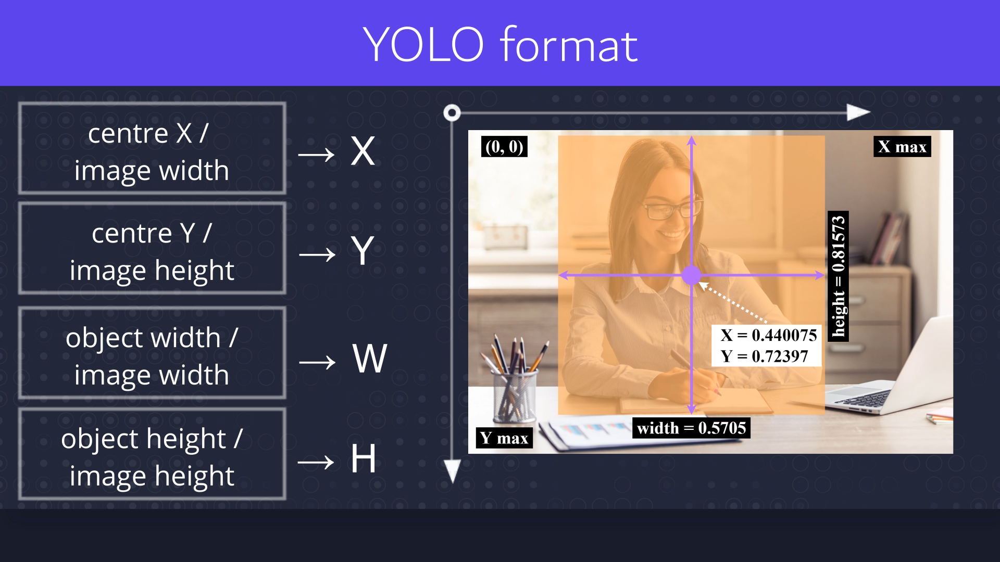
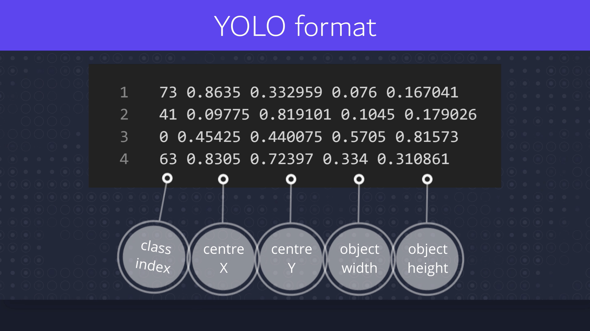
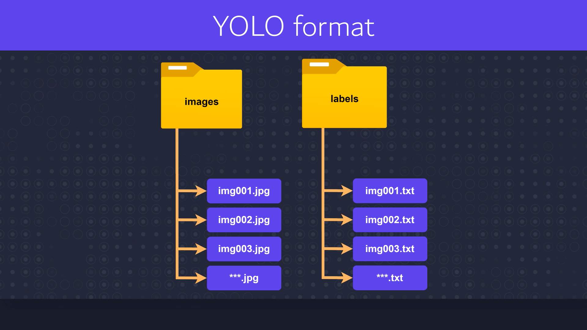
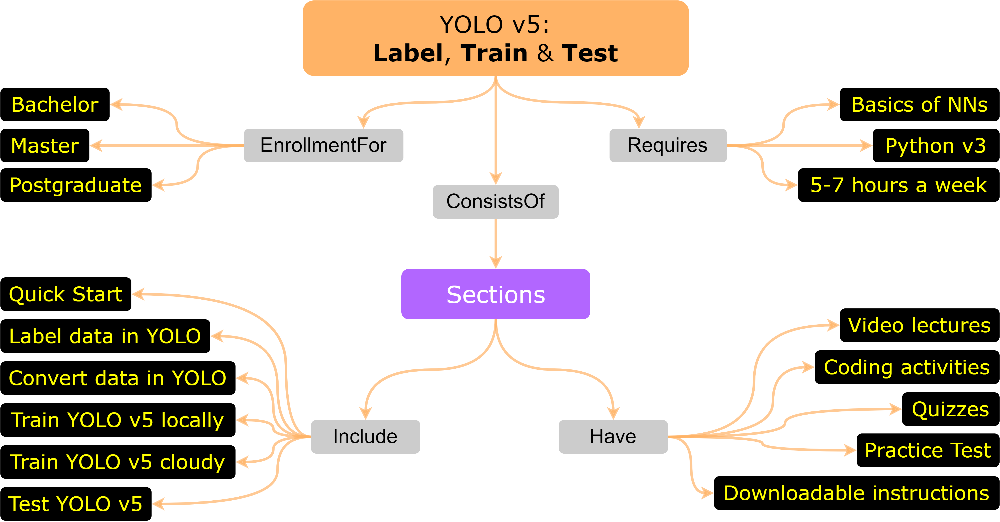

# What is YOLO format?
> How does annotated image in YOLO format looks like? Analyze txt annotation file.

### Equations and axes of the bounding boxes for YOLO format 👇

 

### Coordinates inside annotation txt file for YOLO format 👇

 

### Files structure of the labels and annotations for YOLO format 👇

 

### 🎓 YOLO v5: Label, Train and Test. Join the course! 👇
[https://www.udemy.com/course/yolo-v5-label-train-and-test](https://www.udemy.com/course/yolo-v5-label-train-and-test/?referralCode=2171545772F09930296E)

> **Have a look at the abilities that you will obtain:**  
> 📢 `Run` YOLO v5 to detect objects on image, video and in real time by camera in the first lectures.  
> 📢 `Label-Create-Convert` own dataset in YOLO format.  
> 📢 `Train & Test` both: in your `local machine` and in the `cloud machine` (with custom data and by few lines of the code).  

 

### Concept map of the YOLO v5 course 👇

 

### Join the course! 👇
[https://www.udemy.com/course/yolo-v5-label-train-and-test](https://www.udemy.com/course/yolo-v5-label-train-and-test/?referralCode=2171545772F09930296E)

 

### MIT License
### Copyright (c) 2024 Valentyn N Sichkar
### github.com/sichkar-valentyn
### Reference to:
Valentyn N Sichkar. What is YOLO format? // GitHub platform
